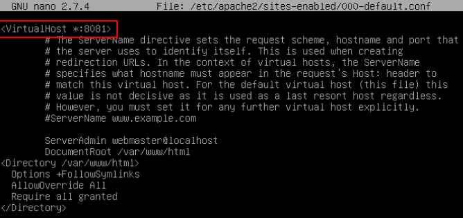

# How to change apache default port in ubuntu

Apache web platform default port is 80. So we are gonna change the default port 80 to custom port. In this notes, I will change 80 port to 8081 port.

```text
vi /etc/apache2/ports.conf
#Listen 80 to change Listen 8081
Listen 8081
#And also have to change in 000-default.conf
vi /etc/apache2/sites-enabled/000-default.conf 
```



Change the port like this and after that we have to restart apache2 service

```text
systemctl restart apache2
netstat -tlpn| grep apache
```

