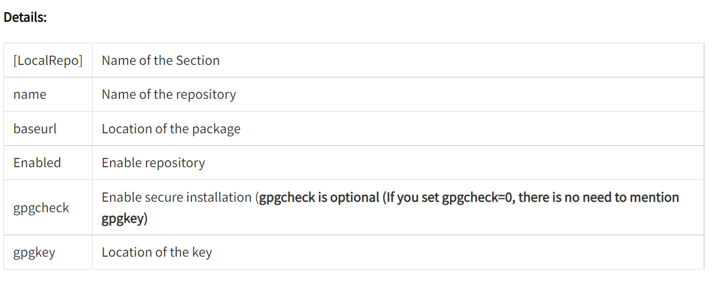

# How To Create Local YUM Repository on RHEL 8 using DVD

Red Hat Enterprise Linux 8 is split across two repositories


* BaseOS
* Application Stream (AppStream)

mount the DVD ROM on any directory of your wish. For testing, I will mount it on /cdrom.

```
mkdir /cdrom
mount /dev/cdrom /cdrom
```

### Create a .repo file

Before creating a .repo file, move the existing files present in /etc/yum.repos.d/directory to/tmp, if no longer required

```
mv /etc/yum.repos.d/*.repo /tmp/
```

Create a repo file called local.repo under /etc/yum.repos.d directory.

```
vi /etc/yum.repos.d/local.repo
```

#### Base OS

```
[LocalRepo_BaseOS]
name=LocalRepository_BaseOS
baseurl=file:///cdrom/BaseOS
enabled=1
gpgcheck=1
gpgkey=file:///etc/pki/rpm-gpg/RPM-GPG-KEY-redhat-release
```

#### App Stream

```
[LocalRepo_AppStream]
name=LocalRepository_AppStream
baseurl=file:///cdrom/AppStream
enabled=1
gpgcheck=1
gpgkey=file:///etc/pki/rpm-gpg/RPM-GPG-KEY-redhat-release
```



