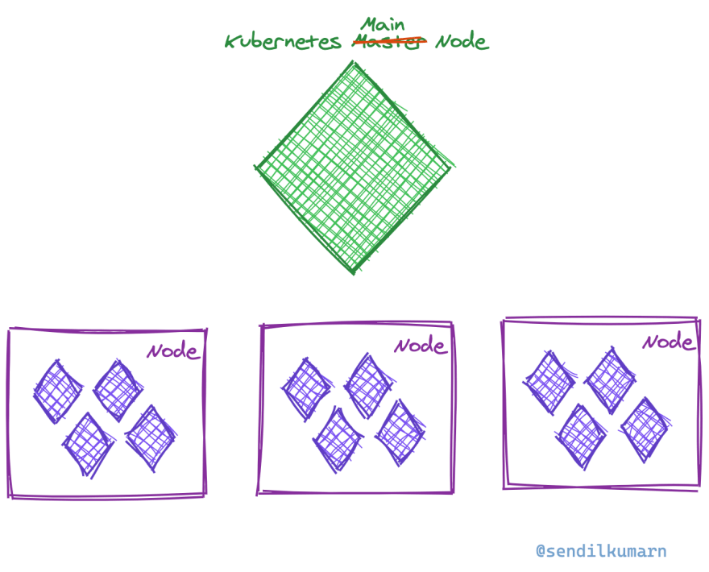
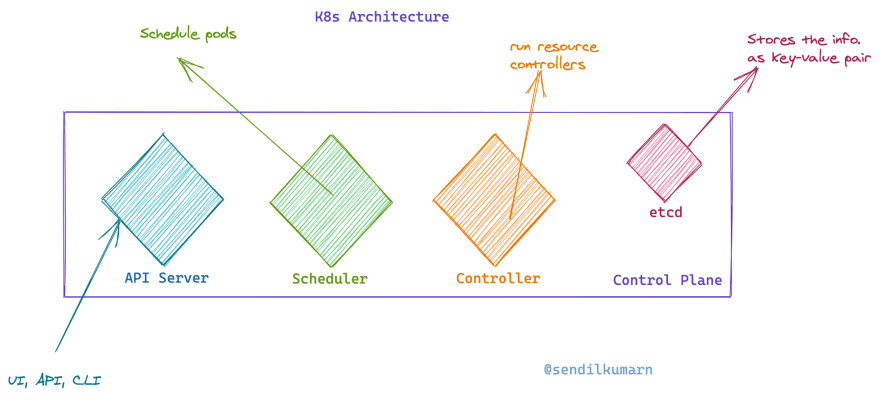
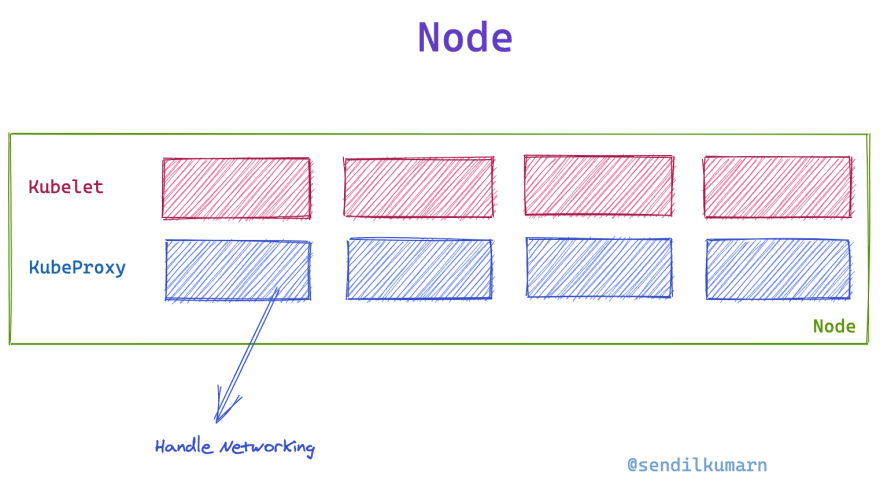

# K8s Intro

K8s ကဘာလဲ? Opensource automation deployment toolတစ်ခုဖစ်တယ် containerization applicationတွေကို Orchestration လုပ်ဖို့အဓိကအသုံးပြုတယ်

K8sဘယ်လိုအလုပ်လုပ်လဲ? K8s cluster တစ်ခုမှ အဓိကအားဖြင့် main nodeနဲ့ worker nodeဆိုပီး ၂ခုရှိမယ် Nodeဆိုတာတွေက Virual serverလဲဖစ်ချင်ဖစ်မယ် physical serverလဲဖစ်ချင်ဖစ်မယ်

Main nodeမှာဘာတွေပါလဲ? Main nodeမှာ controller planeဆိုတာကြီးရှိမယ်.အဲ့ထဲမှာမှ API server ရယ် scheduler ရယ် controller ရယ် etcdရယ်ဆိုပီးရှိမယ် API server က ကျတော်တို့ k8s clusterကို manipulation လုပ်တဲ့အခါမှာသူ့ကိုခေါ်သုံးရတယ် Scheduler က ဘယ် worker nodeမှာ ဘယ်appကို deployလုပ်မယ်ဘာညာဆုံးဖြတ်မယ် Controller က ဘယ် nodeတွေကဘယ်လိုတွေဖစ်နေပီ ဘာညာစသဖြင့်လုပ်ပေးမယ် Etcd က အဓိက cluster ရဲ့ storage key-value အနေနဲဲ့အလုပ်လုပ်မယ်

Worker nodeမှာတော့ ၂မျိုးရှိမယ် Kubelet နဲ့ kubeproxy လောလောဆယ် kubeletကိုတော့ worker nodeရဲ့ node agentလို့မှတ်ထားနိုင်တယ် အဓိကလုပ်တာက worker nodeထဲမှာရှိတဲ့ appတွေအလုပ်လုပ်နေလားဘာညာစသဖြင့်စစ်ဆေးမယ်ပေါ့. Kubeproxy က worker nodes ရဲ့ networkinh rules တွေဘာညာစဖြင့်တာဝန်ယူတယ်

