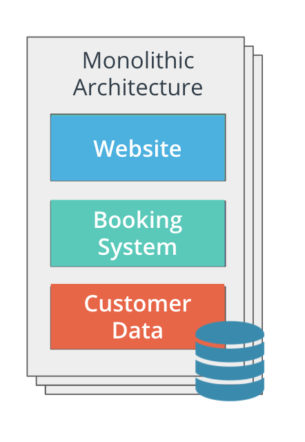

# Monoliths & Microservice

Each architecture encapsulates the 3 main tires of an application:

* UI \(User Interface\) - handles HTTP requests from the users and returns a response
* Business logic - contained the code that provides a service to the users
* Data layer - implements access and storage of data objects

#### Monoliths 

In a monolithic architecture, application tiers can be described as:

* part of the same unit
* managed in a single repository
* sharing existing resources \(e.g. CPU and memory\)
* developed in one programming language
* released using a single binary

#### Microservices 

In a microservice architecture, application tiers are managed independently, as different units. Each unit has the following characteristics:

* managed in a separate repository
* own allocated resources \(e.g. CPU and memory\)
* well-defined API \(Application Programming Interface\) for connection to other units
* implemented using the programming language of choice
* released using its own binary

* **Monolith**: application design where all application tiers are managed as a single unit
* **Microservice**: application design where application tiers are managed as independent, smaller units

