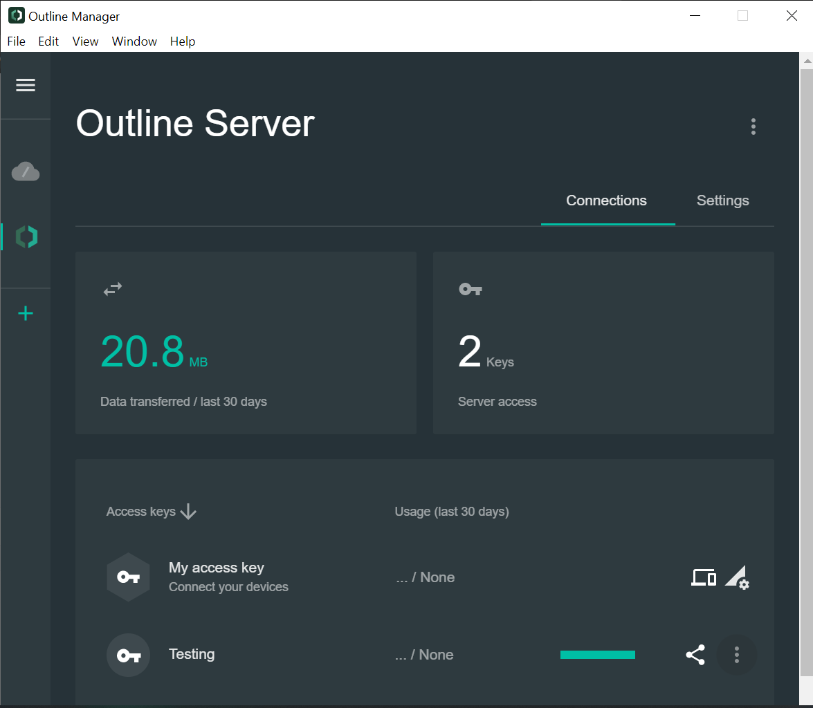
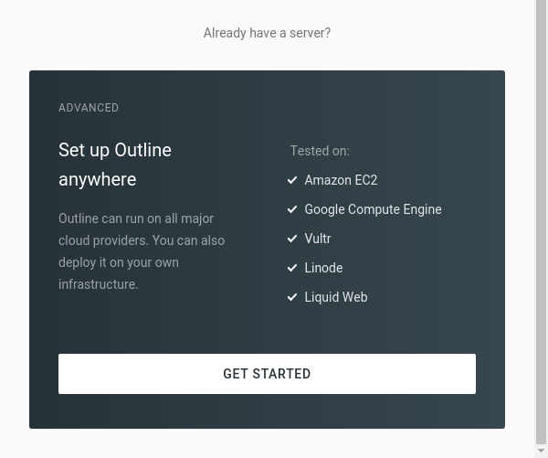
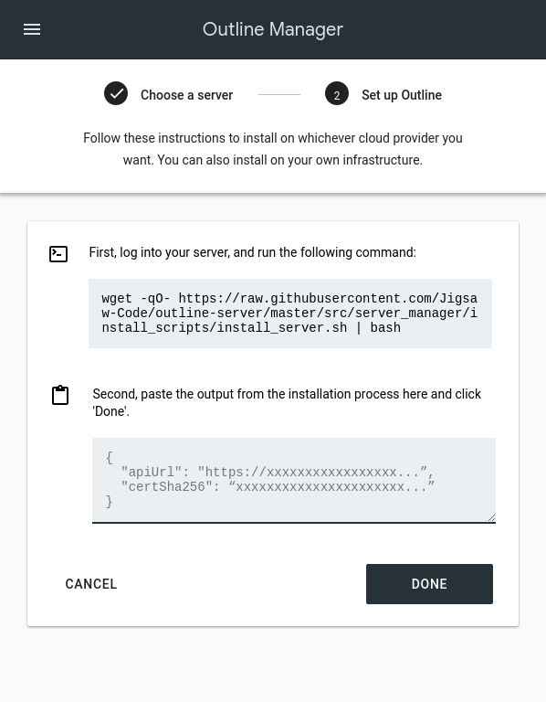

# Outline server

In this period, we need to use vpn for access the facebook , twitter, instagram and other social media platform In Myanmar Because of the military coup.

So I will share to make the outline vpn server in the cloud provider like AWS, Digital ocean and other CSP\(Cloud service provider\).

First of all, we need the vps or sever in CSP.

And after that need to install the docker engine in our server.

```text
sudo curl -sS https://get.docker.com/ | sh
systemctl start docker
systemctl enable docker
```

After installed the docker engine, we have to install the outline server

```text
sudo wget -qO- https://raw.githubusercontent.com/Jigsaw-Code/outline-server/master/src/server_manager/install_scripts/install_server.sh | bash
```

When the Outline VPN server installation script finishes, you’ll see some output like that. **pls save this for later use.**

```text
{
  "apiUrl": "https://123.456.78.9:12345/xxxxxxxxxxxxxxxxxxxxxxx",
  "certSha256": "xxxxxxxxxxxxxxxxxxxxxxxxxxxxxxxxxxxxxxxxxxxxxxxxxxxxxxxxxxxxxxxx"
}
```

After that we will need the software called Outline Manager. We can easily download that from outline vpn website. The software will be like this 



When you open the Outline Manager software, scroll down to Set up Outline anywhere and click on the Get started button



You’ll see two steps.  second step, all you need to do is copy the output from the after installation of outline server and click done.



