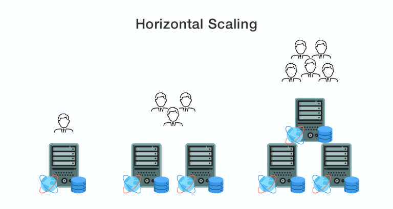
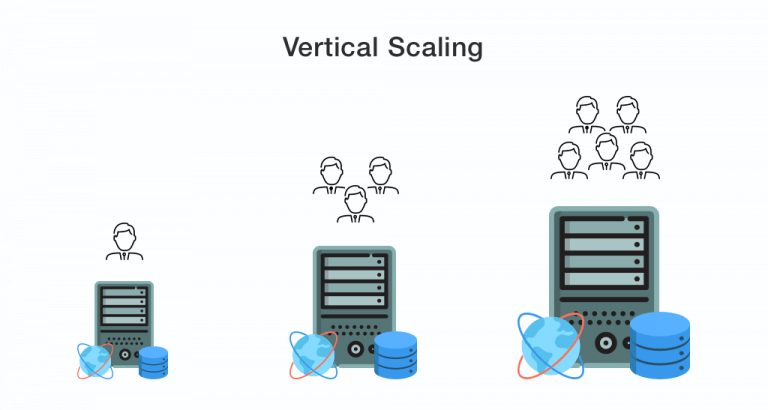

# Scaling

Scalingဆိုတာကဘာလဲ? Scaling မှာဘယ်နမျိုးရှိသေးလဲ? ဟုတ်ကဲ့.scalingကိုသိပီးသားလူတွေလဲသိပီးကြသလို မသိသေးတဲ့လူတွေလဲမသိသေးကြပါဘူး.အိုဂေ scalingဆိုတဲ့စကားက ကျွန်တော်တို့IT filedမှာ 99.99% no downtime High Availability တွေနဲ့တွဲပီး​ကြားဖူးရင်လဲကြားဖူးကြပါလိမ့်မယ်.ဆိုတော့သူကဘာလဲပေါ့ ရှင်းပါတယ် scalingဆိုတာ ကျွန်တော်တို့ infraရဲ့ IT resources တွေကို အရေအတွက်ချတာ အရေအတွက်တိုးတာ လို့မှတ်ယူလို့ရပါတယ်.အဲ့တော့သူ့မှာက scaling method 2မျိုးရှိပါတယ်.ကိုယ့် environment နဲ့လိုက္ဖက္မဲ့ method ကိုရွေးပီးဆုံးဖြတ်ရမှာကိုယ့်တာဝန်ပါ.ဆိုတော့ ၂မျိူးကဘာလဲဆိုတော့ Horizontal scaling နဲ့ vertical scaling တို့ဘဲဖစ်ပါတယ်

&#x20;1\. Horizontal scaling Horizontal scaling,ဒီကောင်ကဘယ်လိုမျိုးလဲဆိုရင်ကျတော်တို့ service အတွက်သုံးထားတဲ့ instance or server တစ်လုံးကို cpu 1 လုံး ram 4 gb နဲ့ runထားတယ်ဆိုပါစို့.. ဒါမဲ့ လကုန်ခါနီးမှာအဲ့ service ကလူသုံးကများလာတယ် loadကမနို်င်တော့ဘူးဆို ကျတော်တို့သုံးထားတဲ့ cpu 1လုံး ram 4gb နဲ့ နောက်တလုံးကိုထပ်လုပ်ပီး LB လုပ်ပီးသုံးတာမျိုးပေါ့.

&#x20;2\. Vertical scaling သူကဘယ်လိုစကေးလင်းလုပ်တာလဲဆိုတော့ ကျတော့်တို့ရဲ့ infra မှာ IT resources တွေဖစ်တဲ့ cpuတွေ ramတွေ storageတွေကိုတိုးတာမျိုးပါ.ထားပါတော့ သုံးလာတဲ့userက များလာတဲ့အခါ cpu ထပ်တိုးတာမျိုး ramတွေထပ်တိုးတာမျိုးကိုဆိုလိုတာဖစ်ပါတယ်

